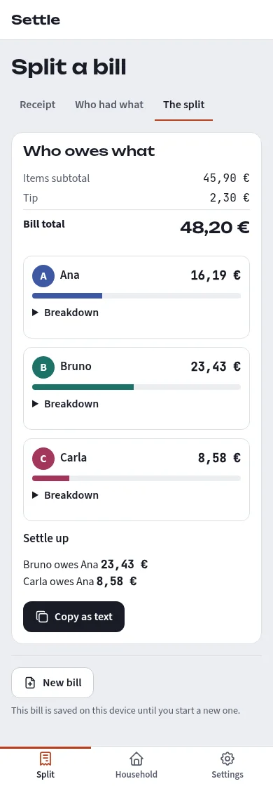

# Settle

**Split bills. Settle up. Stay private.**

Split bills fairly, and keep track of a shared household's expenses
and who owes whom, all in your browser. You scan a receipt or type in a
bill's items, say who had what, and Settle shows who owes what, down to
the cent. There are no accounts and no server: everything stays on your
device. In English or European Portuguese.



## What works today

- **Split a bill, in three steps.** **Receipt**: scan one, or type the
  items in. **Who had what**: the people, the items (name, quantity,
  price), and tax, a tip and a discount, as an amount or a percentage.
  Choose a person, then tap the items they had; "Everyone" shares an item
  with all, and Edit gives custom shares. **The split**: each person's
  total as a bar in their colour, with a breakdown, and who owes the
  person who paid. On a wide screen the split sits beside the items and
  updates as you go. The browser's Back button moves between the steps.
  The totals always add up to the bill total exactly, and leftover cents
  are shared out fairly across the whole bill. Copy the result as text to
  send it to your friends.
- **Scan a receipt.** Choose a photo or PDF of a receipt (JPEG, PNG, HEIC
  or PDF), take a photo on your phone, or drop the file on the page.
  Settle reads it on your device with PaddleOCR, an open-source
  text-recognition engine, then fills in the items for you. Portuguese
  and English receipts work best. When a Portuguese receipt has a fiscal
  QR code, its total, date and NIF are read from the code, which is
  exact. A store app's PDF receipt is read from its text, exactly, with
  no recognition at all. A **Receipt check** shows what was read,
  compares the items with the receipt's total as you edit them, and marks
  the lines it wasn't sure about. You review and fix the items, then split
  the bill as usual. If a receipt can't be read, you type the items in.

  **Measured on real receipts** (19 receipts from Portuguese shops and
  restaurants, read in a real browser, M2.5): about 8 in 10 receipt
  photos and screenshots come in with **no edit needed** (81–86 %), about
  96 % of the item lines are read at the right price, and a receipt
  with a wrong or missing price never shows "Matches": the check flags
  it instead.

  - **Photo advice.** While a receipt is being read, Settle checks the
    photo first: text too small, blurred, too dark or faint, cut off at
    an edge, or taken from too far away. It says what to do (move closer,
    hold the phone steady, find more light, include the whole receipt, or
    for an app receipt send the original image or its PDF), so you can
    cancel and take a better photo. It's advice only: the reading goes on.
  - **Review lines.** The check can show every line the reader found: the
    receipt image with a box over each line, coloured by what it was read
    as (an item, a discount, the total, a payment, an ignored line…), and
    the same lines as a list. Select a line to see its box and its item
    in the bill. A line read but left out can be added as an item, and so
    can a line the reader missed.
  - When the items don't add up to the receipt's total, you can't miss
    it: the result says so, and so does the copied text, and one click
    adds the missing difference as an item. If only part of a receipt was
    read, the check says how much. When no item could be read but the
    receipt has a fiscal QR code, its total comes in as one item to split
    as it is. And if the import left out lines at the bottom of the
    receipt to match its total, it lists them until you confirm they
    aren't items, or put them back.

  **Known limits:**
  - Reading takes time: about 6–8 seconds per receipt on a desktop
    computer, and longer on a phone (up to about 30 seconds). The first
    scan also downloads the reader (about 27 MB).
  - Small screenshots, where the whole receipt is shrunk to fit one image,
    can lose digits. Send the original image from the receipt app (for
    example as a document), or its PDF.
  - Crumpled, faded or blurred receipts, and lines on a fold of the
    paper, may be misread; the check shows the gap.

- **English and Portuguese.** The whole app is in English and European
  Portuguese. It follows your browser's language until you choose one in
  Settings.
- **Region.** In Settings, choose how amounts are typed and shown:
  Portuguese, UK or US number format, and euros, pounds or US dollars. The
  default is Portuguese format in euros. Changing the currency only
  changes the symbol; nothing is converted. The language and the region
  are separate: Portuguese text with UK numbers is fine.
- **Light and dark themes**, following your system or chosen in Settings
  (or with the toggle in the header on a wide screen).
- **Phones and desktops.** One web app: a tab bar at the bottom on a
  phone, a menu at the top on a wider screen.

- **Households** (M4). Keep track of what a group shares over months:
  a flat, a holiday, a club. A household has a name, its members and
  its expenses. Several can live on one device, and one can be archived
  and restored.
  - **Members** can be added, renamed, and marked as left on a date. Someone
    who left stays on every past expense.
  - **A quick expense** is an amount split equally, by shares, by exact
    amounts or by percentages, with each share shown as you type.
  - **An itemised expense** is the split above, scanned or typed in, saved
    into a household. "Save to a household" moves the bill in, and you
    can edit its items later.
  - **Who paid** can be anyone in the household, even someone not sharing
    the expense.
  - **The overview** shows a month at a time: what was shared, the latest
    expenses and where the money went, with charts beside the figures (each
    day's spending, a donut of the categories, the last six months).
  - **The Expenses tab** lists everything, newest first. Filter it by person
    or category, and search it, ignoring accents ("agua" finds "Água").
  - An expense opens over the list you were on, with each person's share.
    It can be edited or deleted there; every total is worked out again from
    the expenses themselves.
  - Saving the same receipt twice into a household shows a warning.

- **Balances and settling up** (M5). Each household has a Balances tab:
  - **Each member's balance** across the whole history: "Gets back 91,15"
    or "Owes 22,40", or "Settled up". It is worked out again from the
    expenses and payments each time, exact to the cent.
  - **Settle up in N payments:** the fewest payments that clear every
    balance, always the same for the same data, each with **Mark as
    paid**.
  - **Record a payment** between any two members, for the full amount or
    part of it. The dialog shows both people's balances after it, before
    you save. Payments sit in the Expenses list with the expenses, outside
    the spending totals, and can be edited or deleted.
  - **Why is my balance this?** A member's balance opens the expenses and
    payments that make it up, adding up to it.
  - **Copy as text** (or **Share**, where the browser can) gives the
    balances and the payments, ready for a group chat.
  - **Balances on a past date**, to see what was owed then.
  - The overview shows the balances and the settle-up line too.
  - If a saved record can't be read, the balances are shown as figures
    only: Settle never suggests a payment from a ledger it knows is
    incomplete.
- **Charts** show each value at once when you point at, tap or tab to a
  bar or a slice.

Export and backup are next on the [roadmap](docs/ROADMAP.md).

## Try it

There's no hosted version yet. To run it on your computer, you need
Node.js and npm; the steps are in [`app/README.md`](app/README.md). In
short, from the `app/` folder:

```sh
npm ci
npm run dev
```

Then open the address it prints and choose **Split a bill**.

## Privacy

Everything runs in your browser. The bill you're editing, the receipt
check's summary and your settings (language, theme, region) are saved in
your browser's storage on this device only, so a refresh doesn't lose
them. **New bill**
clears them. Your households, members, expenses and payments are saved
in your browser's own database (IndexedDB), on this device only. Nothing
is sent anywhere: Copy as text and Share hand the text only to your own
clipboard or your device's share sheet.

Until export and backup arrive (M6), clearing this site's data in your
browser deletes your households. Settle asks the browser to keep its data
when you create your first household.

**Receipts are read on your device and never uploaded.** Settle has no
server to send them to. The receipt image stays in memory while you
review it and is never saved, and so are the photo advice and the
reviewed lines. The first time you scan a receipt, your browser downloads
the reader (the PaddleOCR engine and its models, about 27 MB) from
Settle itself, not from anyone else, and keeps it for next time. A strict content security
policy stops the page from contacting any other site.

## Third-party licences

Receipt reading uses open-source libraries: PaddleOCR's models (through
ppu-paddle-ocr and ONNX Runtime Web), zxing-wasm, pdf.js and heic-to.
Settle's look uses three open-source fonts (Unbounded, JetBrains Mono and
Source Sans 3) and the Tabler icons, all served from Settle itself. heic-to, which opens HEIC photos in browsers that
can't, is licensed under the LGPL-3.0 and is shipped as its own,
unmodified file. Each library, its licence and its source are listed in
[`app/public/THIRD_PARTY_NOTICES.md`](app/public/THIRD_PARTY_NOTICES.md),
which the app also links from Settings.

## Roadmap and releases

- The plan, milestone by milestone: [`docs/ROADMAP.md`](docs/ROADMAP.md).
- Every change merged into `master` is published as a
  [GitHub Release](https://github.com/jfilipegm/project-Settle/releases). The
  version number follows the kind of change: a new feature raises the
  minor version, and any other change raises the patch version.
